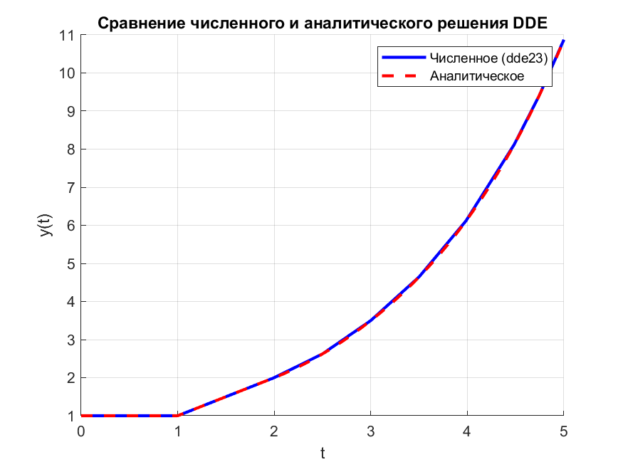

```matlab
% Параметры DDE
lags = 1;                % запаздывание
ddefun = @(t,y,Z) Z;     % y(t-1)
tspan = [0 5];

% Начальная функция для t<0 и y(0)=1
history = @(t) 0;         
history0 = @(t) (t==0)*1; 

% Численное решение с помощью dde23
sol = dde23(ddefun, lags, history0, tspan);

% Построение численного решения
figure; hold on;
plot(sol.x, sol.y, 'b', 'LineWidth', 2);

% Построение аналитического решения кусочно
t = linspace(0,5,1000);
y = zeros(size(t));

for i = 1:length(t)
    if t(i) < 1
        y(i) = 1;
    elseif t(i) < 2
        y(i) = t(i);
    elseif t(i) < 3
        y(i) = (t(i)-1)^2/2 + 3/2;
    elseif t(i) < 4
        y(i) = (t(i)-2)^3/6 + 3/2*t(i) - 7/6;
    else
        y(i) = (t(i)-3)^4/24 + 3/4*(t(i)-1)^2 - 7/6*t(i) + 97/24;
    end
end

plot(t, y, 'r--', 'LineWidth', 2);

xlabel('t'); ylabel('y(t)');
legend('Численное (dde23)','Аналитическое');
grid on;
title('Сравнение численного и аналитического решения DDE');

% Сохранение графика
saveas(gcf, 'practice_1_1.png');
```
