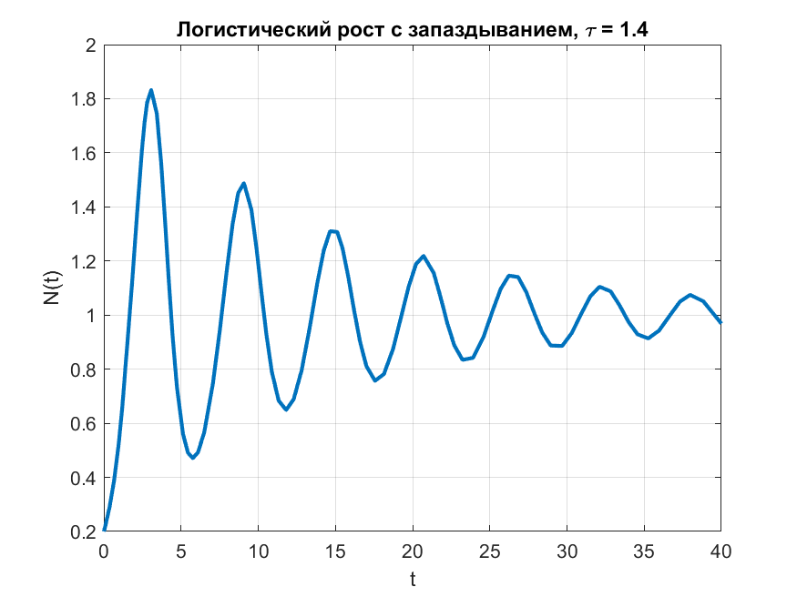
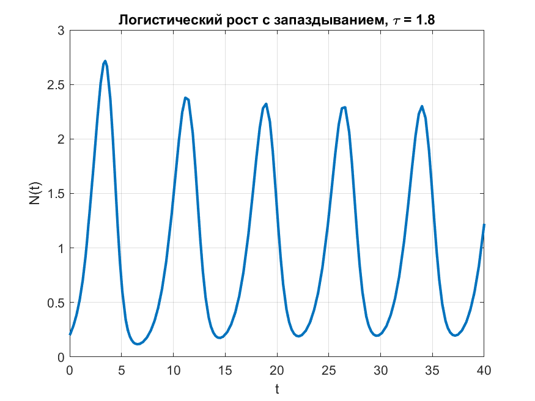
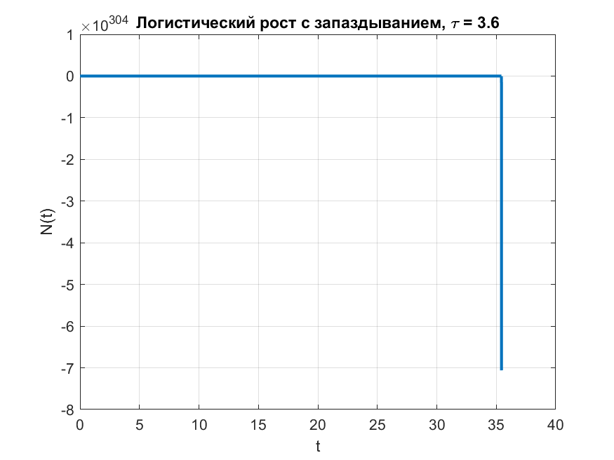

# Логистический рост с запаздыванием

Решить уравнение логистического роста с запаздыванием:

\[
N'(t) = b \cdot N(t) \left(1 - \frac{N(t-\tau)}{C}\right), \quad \tau \ge 0
\]

с параметрами:

- \(b = 1.0\)
- \(C = 1.0\)
- Начальные условия: \(N(0) = 0.2\)
- Функция для отрицательных времен: \(N(t) = 0.0, \quad -\tau \le t < 0\)
- Значения запаздывания: \(\tau = \{0.2, 1.4, 1.8, 3.6\}\)
- Интервал построения графика: \(t \in [0, 40]\)

**Задачи:**

1. Решить уравнение для каждого значения \(\tau\).
2. Построить графики решения на отрезке \([0,40]\) и сравнить влияние задержки.
---
```matlab
%% Логистический рост с запаздыванием - отдельные графики и сохранение
clc; clear; close all;

% Параметры
b = 1.0;
C = 1.0;
N0 = 0.2;
taus = [0.2, 1.4, 1.8, 3.6];
tspan = [0 40];

for i = 1:length(taus)
    tau = taus(i);

    % Функция с задержкой
    dde_fun = @(t, N, Z) b * N * (1 - Z / C);

    % Историческая функция
    history = @(t) (t < 0) * 0 + (t >= 0) * N0;

    % Решение DDE
    sol = dde23(dde_fun, tau, history, tspan);

    % Создание графика
    figure; 
    plot(sol.x, sol.y, 'LineWidth', 2);
    grid on;
    title(['Логистический рост с запаздыванием, \tau = ', num2str(tau)]);
    xlabel('t'); ylabel('N(t)');
    
    % Сохранение графика
    filename = ['practice_2_1_', num2str(i), '.png'];
    saveas(gcf, filename);
end

```




