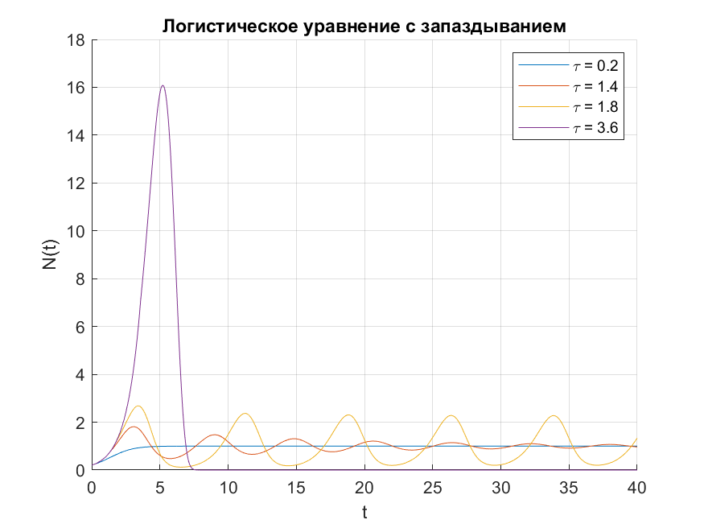

# Логистический рост с запаздыванием

Решить уравнение логистического роста с запаздыванием:

\[
N'(t) = b \cdot N(t) \left(1 - \frac{N(t-\tau)}{C}\right), \quad \tau \ge 0
\]

с параметрами:

- \(b = 1.0\)
- \(C = 1.0\)
- Начальные условия: \(N(0) = 0.2\)
- Функция для отрицательных времен: \(N(t) = 0.0, \quad -\tau \le t < 0\)
- Значения запаздывания: \(\tau = \{0.2, 1.4, 1.8, 3.6\}\)
- Интервал построения графика: \(t \in [0, 40]\)

**Задачи:**

1. Решить уравнение для каждого значения \(\tau\).
2. Построить графики решения на отрезке \([0,40]\) и сравнить влияние задержки.
---
```matlab
clear; clc; close all;

taus = [0.2, 1.4, 1.8, 3.6];

b = 1.0;
C = 1.0;
N0 = 0.2;
t_max = 40;
dt = 0.01;

figure; hold on;

for tau = taus
    % временной массив
    t_vals = 0:dt:t_max;
    N_vals = zeros(size(t_vals));
    N_vals(1) = N0;

    for i = 2:length(t_vals)
        t = t_vals(i);
        t_delay = t - tau;

        % интерполяция задержанного значения
        if t_delay < 0
            N_delay = 0;
        else
            % линейная интерполяция (аналог numpy.interp)
            N_delay = interp1(t_vals(1:i-1), N_vals(1:i-1), t_delay, 'linear');
        end

        % правые части
        dNdt = b * N_vals(i-1) * (1 - N_delay / C);

        % шаг Эйлера
        N_vals(i) = N_vals(i-1) + dNdt * dt;
    end

    plot(t_vals, N_vals, 'DisplayName', ['\tau = ' num2str(tau)]);
end

title('Логистическое уравнение с запаздыванием');
xlabel('t');
ylabel('N(t)');
grid on;
legend show;
saveas(gcf, 'logistic_delay_plot.png');     % PNG


```

